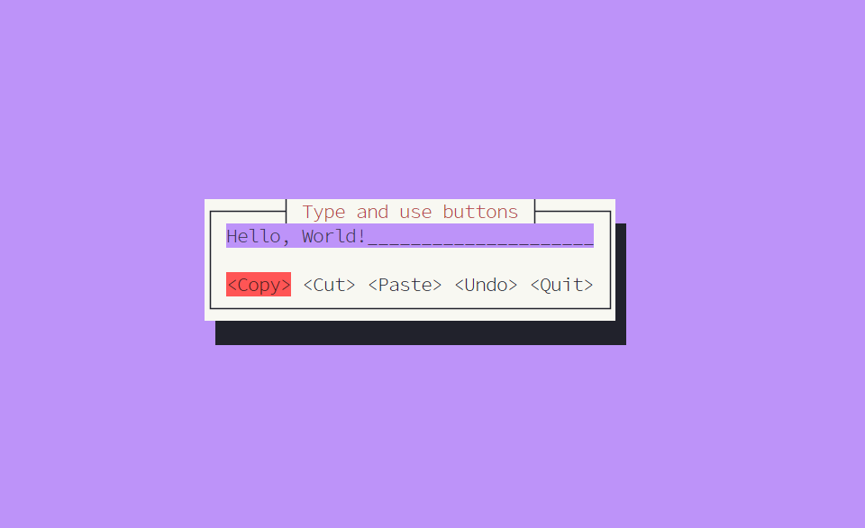

# Command

**Command** is behavioral design pattern that converts requests or
simple operations into objects.

A specific thing about Command Pattern implementation in 🦀 Rust is that
a command instance should NOT hold a permanent reference to global context,
instead the latter should be passed from top to down as a mutable parameter
of the "`execute`" method:

```rust
fn execute(&mut self, app: &mut cursive::Cursive) -> bool;
```

## Text Editor: Commands and Undo

How to launch:

```bash
cargo run --bin command
```

Key points:

- Each button runs a separate command.
- Because a command is represented as an object, it can be pushed into a
  `history` array in order to be undone later.
- TUI is created with `cursive` crate.



## Notes

This example is inspired by [Command in Java (Example)](https://refactoring.guru/design-patterns/command/java/example).
